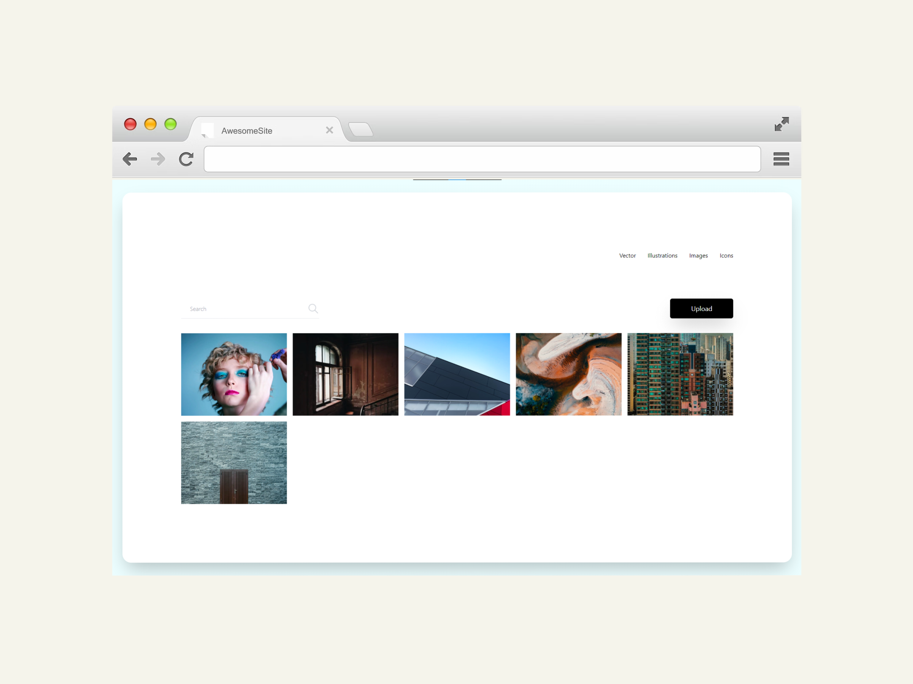
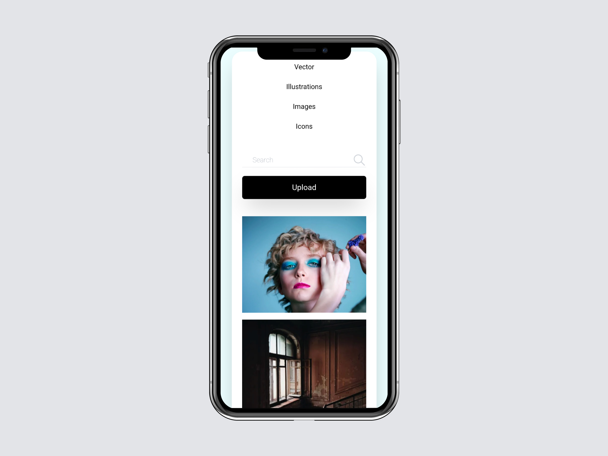
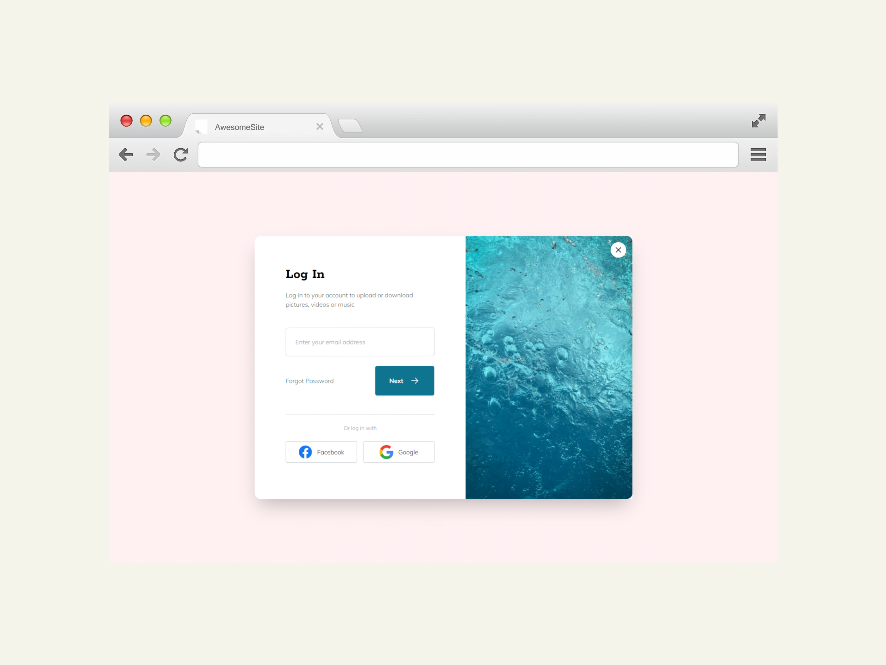
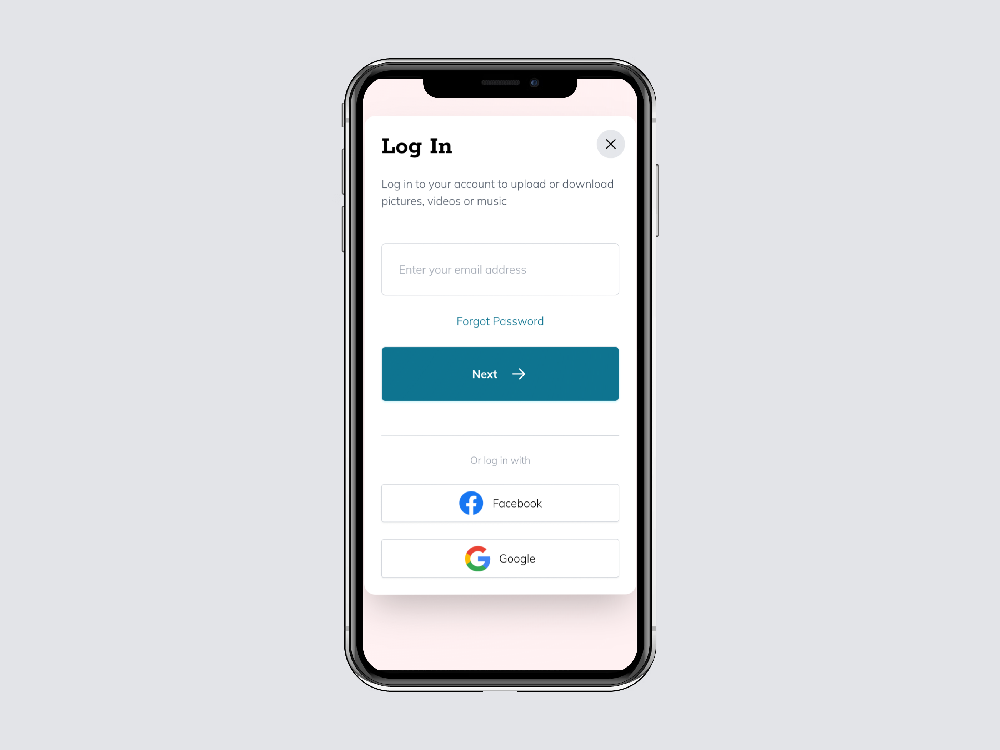
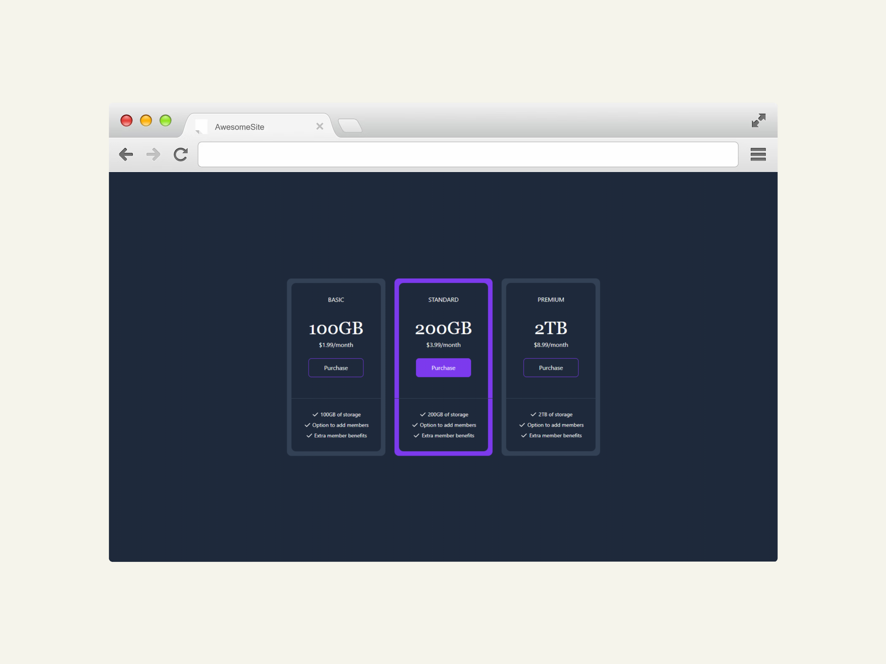
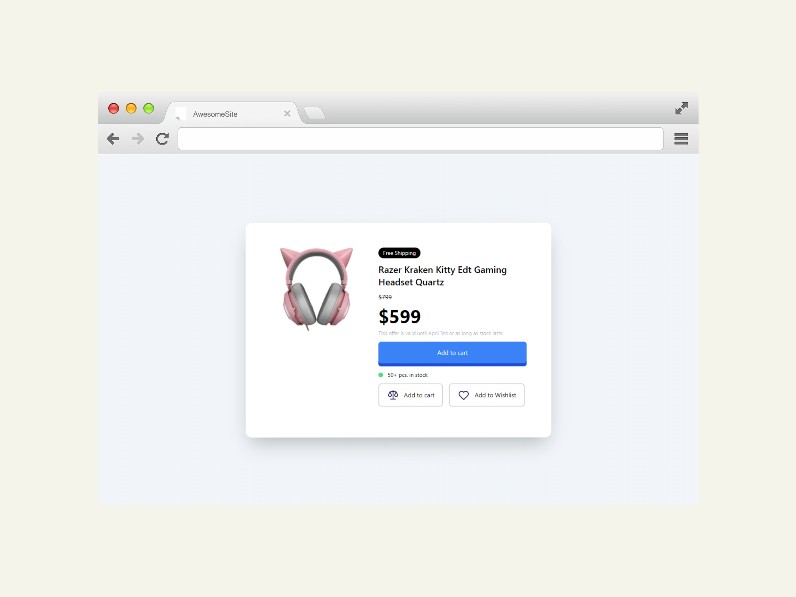
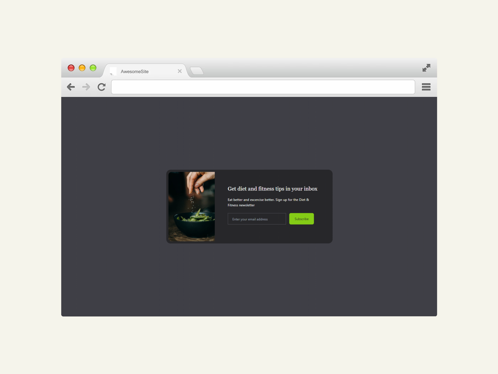
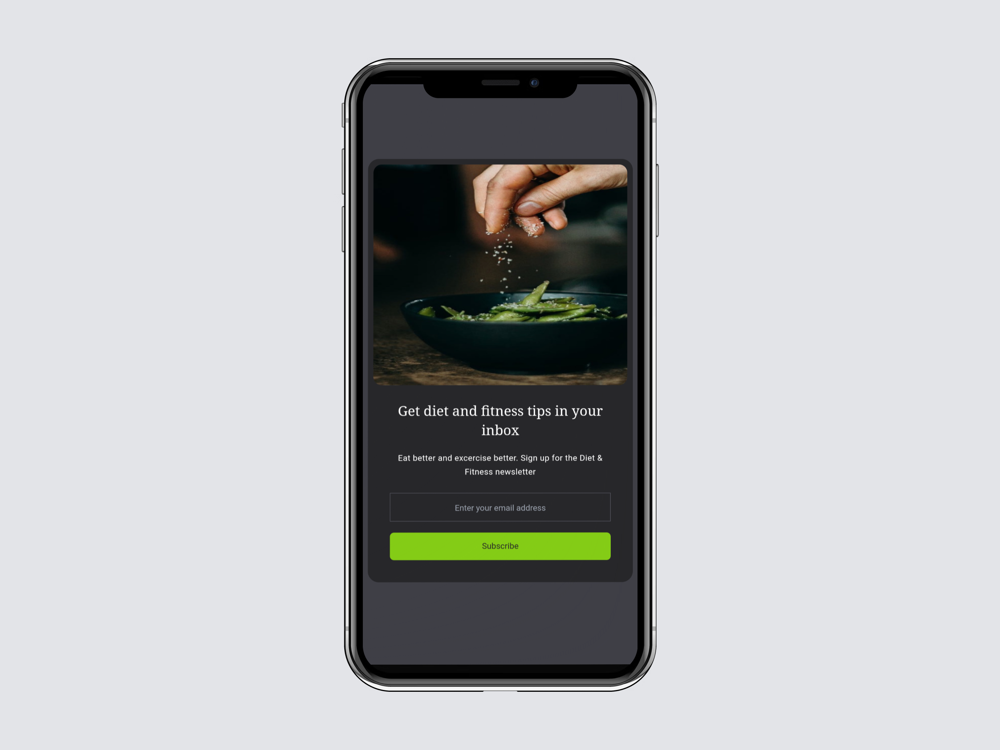

# Tailwind Projects

A collection of website projects based on the udemy course "[Tailwind CSS From Scratch | Learn By Building Projects](https://www.udemy.com/course/tailwind-from-scratch/)" by Brad Traversy. The objective of these projects are to learn and practice Tailwind CSS. The projects were templated and built with Vite.

The projects are only for UI and the functional aspects are not implemented.

## Projects

### Bookmark

Landing page for a web browser extension to manage bookmarks.
Bookmark has functioning tabs and panels.

### Clipboard

Landing page for an iOS/Mac application to manage clipboard.

### Fylo

Landing page for a cloud file hosting service.
Fylo has a functioning Dark Mode Toggle.

### Loopstudios

Landing page for VR experience studio, Loopstudios.
Loopstudios has a functioning hamburger menu.

### Shortly

Landing page for a website to generate shortlinks.
Shortly has a functioning hamburger menu.

## Testimonial Grid

A grid layout showcasing testimonials.

## Mini-Projects

### Image Gallery

### Login Modal

### Pricing Grid

### Product Modal

### Email Subscribe

